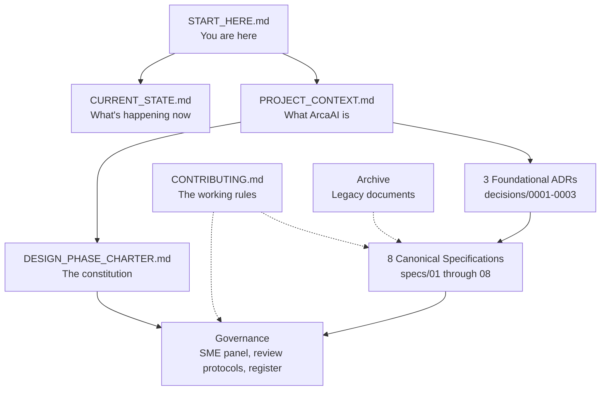

# Start Here

If you are new to this repository, this is the right document to open first.

This map answers three questions:

1. **I am [type of reader] — where do I start?** → Section 1
2. **I have read X — what should I read next?** → Section 2
3. **I have a specific question — where is the answer?** → Section 3

---

## The shape of this repository in one diagram

The solid arrows show "read this to understand that." The dotted arrows show "this governs how that works."

---

## Section 1 — Where to start, by reader type

Find your role below. The "first read" column is what to open immediately. The "next reads" column is what to read once the first read is understood.

### If you are a bank-side reviewer

| Your role | First read (15 min) | Next reads (1-2 hours) | What you can skip |
|---|---|---|---|
| **Bank CTO / CDAO** evaluating the platform | `PROJECT_CONTEXT.md` | Product Definition spec → Solution Architecture spec → Technical Architecture spec → the three foundational ADRs | Deep engineering detail marked `[DETAIL]`; governance internals |
| **Bank Model Risk** reviewer | `PROJECT_CONTEXT.md` then ADR-0001 and ADR-0002 | Data and ML spec → Test and Validation spec → Security and Compliance spec | Operations runbooks; integration plumbing |
| **Bank InfoSec / CISO** | `PROJECT_CONTEXT.md` | Security and Compliance spec → Integration spec → Operations and Support spec | ML training methodology specifics; product positioning |
| **Bank Integration / Architecture** lead | `PROJECT_CONTEXT.md` | Solution Architecture spec → Technical Architecture spec → Integration spec → Operations and Support spec | Marketing positioning; SME governance |
| **Bank Procurement** | `PROJECT_CONTEXT.md` | Product Definition spec → DESIGN_PHASE_CHARTER.md | Implementation detail across most specs |
| **Bank Executive Sponsor** | The first two paragraphs of `PROJECT_CONTEXT.md` | Product Definition spec (sections 1-3 only) | Everything else — delegate the detail to your team |

Bank-side reviewers read each spec at the **summary tier**. Detail-tier content is marked `[DETAIL]` in the spec body and can be skipped.

For each spec you read, check its **Section 4 — Sister specifications**. The sister table tells you which other specs cover content essential to a complete picture.

### If you are Arca engineering

| Your role | First read | Next reads | What you can skip initially |
|---|---|---|---|
| **New engineering joiner** | `PROJECT_CONTEXT.md` → `DESIGN_PHASE_CHARTER.md` → `CONTRIBUTING.md` | The three foundational ADRs → all 8 spec READMEs → the specs themselves in order | Archive contents until needed |
| **Solution architect** working on a specific spec | `PROJECT_CONTEXT.md` → that spec's README → the spec's sister list | The sister specs themselves; the relevant ADRs | Specs unrelated to your spec |
| **ML engineer** working on the pipeline | `PROJECT_CONTEXT.md` → ADR-0002 → ADR-0003 | Data and ML spec → Test and Validation spec → Technical Architecture spec | Product Definition; Operations until later |
| **Platform engineer** working on infrastructure | `PROJECT_CONTEXT.md` → ADR-0003 | Technical Architecture spec → Operations and Support spec → Integration spec | Product Definition; data/ML internals |
| **DevOps / SRE** preparing operations | `PROJECT_CONTEXT.md` → `DESIGN_PHASE_CHARTER.md` | Operations and Support spec → Test and Validation spec → Integration spec | Product Definition |

Engineering reads each spec end-to-end including `[DETAIL]` content.

### If you are on the SME review panel

| Your role | First read | Next reads |
|---|---|---|
| **AI SME reviewing a specific spec** | Your prompt primer in `governance/sme-prompt-primers/` | `PROJECT_CONTEXT.md` → the three foundational ADRs → the spec being reviewed → any sister specs the primer indicates |
| **Cross-spec consistency reviewer (NotebookLM)** | `governance/review-protocols.md` → `PROJECT_CONTEXT.md` | All in-flight specs loaded as sources |
| **Fresh-eyes Claude (Round 3 only)** | `governance/sme-prompt-primers/claude-fresh-eyes-primer.md` | Only the materials the primer attaches. Do not pull in prior context — that is the point of fresh-eyes review. |

SME reviewers should not read more than the primer tells them to. Adding context defeats the role-differentiation that makes the panel valuable.

### If you are Mike

You wrote most of this. You know where it is.

### If you are an AI assistant (Claude, ChatGPT, etc.) being given this repository as context

Read in this order:

1. This document (START_HERE.md)
2. `PROJECT_CONTEXT.md` — the stable primer
3. `CURRENT_STATE.md` — what's in progress
4. `SESSION_NOTES.md` — the chronological reasoning trail; **read this carefully — it contains decisions future sessions should not re-litigate**
5. `SESSION_PROTOCOLS.md` — the opening and closure rituals every session follows
6. The three foundational ADRs in `decisions/`
7. `CONTRIBUTING.md` — the working rules
8. Whatever specific work Mike has asked you to do, plus its named sister specs

Do not assume capabilities or context beyond what is in these documents. If a reference is unclear, ask.

---

## Section 2 — Progression: what to read next

This section is for readers working through the repository in depth. It assumes you have already read `START_HERE.md` (this document) and `PROJECT_CONTEXT.md`.

### After PROJECT_CONTEXT.md, read these in order

1. **`SESSION_NOTES.md`** — the chronological reasoning trail. Crucial for understanding what's been settled and why.
2. **`SESSION_PROTOCOLS.md`** — the opening and closure rituals for every chat session.
3. **The three foundational ADRs** — `decisions/0001`, `0002`, `0003`. Together about 15 minutes of reading. Everything in the specs flows from these.
4. **DESIGN_PHASE_CHARTER.md** — the constitution. Tells you what we are doing, how, with whom, and over what timeline.
5. **CURRENT_STATE.md** — the weekly snapshot. What is in flight right now.
6. **specs/README.md** — the index of all eight specifications with their current status.

After those six documents (about 60 minutes of reading total) you have a complete operating picture of the project.

### After the four orientation documents

Read specifications in this recommended order:

1. **Product Definition** (`specs/01-product-definition/`) — the canonical positioning
2. **Solution Architecture** (`specs/02-solution-architecture/`) — the platform structure
3. **Technical Architecture** (`specs/03-technical-architecture/`) — what the platform is built with

These three cover the platform at the framework level. After them, branch by interest:

- **For ML and data work:** Data and ML → Test and Validation
- **For security and regulatory work:** Security and Compliance → Operations and Support
- **For integration and operations work:** Integration → Operations and Support

The full set of eight specifications takes a serious reader 4-6 hours to absorb properly. Skim-reading is detectable and a poor investment — these specifications are designed for deep reading, not surface scanning.

### After the specifications

If you want to understand the governance layer:

1. `CONTRIBUTING.md` — the working rules
2. `governance/sme-panel.md` — who reviews what
3. `governance/review-protocols.md` — the three-round process
4. `governance/document-register.yaml` — the machine-readable status of everything

If you want to understand the historical context:

1. `archive/README.md` — what was retired and why
2. The rationalisation map (when complete) — what migrated from where into the current specs

---

## Section 3 — Where to find specific things

| If you want to find... | Open... |
|---|---|
| **What ArcaAI is and what it delivers** | `PROJECT_CONTEXT.md`, then Product Definition spec |
| **What's been decided in prior chat sessions** | `SESSION_NOTES.md` |
| **How a chat session should open and close** | `SESSION_PROTOCOLS.md` |
| **Why we made a specific architectural decision** | `decisions/` — read the relevant ADR |
| **The five-layer architecture** | Solution Architecture spec (when drafted); meanwhile, the legacy v0.6 in `archive/` |
| **The three-stage model lifecycle** | ADR-0002, then Data and ML spec (when drafted) |
| **The upskilling pipeline** | Data and ML spec, Part B (when drafted) |
| **Pre-trained reference models — what we ship** | ADR-0001, then Data and ML spec Part A (when drafted) |
| **Regulatory mapping (PRA SS1/23, EU AI Act, etc.)** | Security and Compliance spec (when drafted) |
| **How a bank integrates ArcaAI** | Integration spec (when drafted) |
| **What is happening this week** | `CURRENT_STATE.md` |
| **The timeline and milestones** | `DESIGN_PHASE_CHARTER.md`, section 7 |
| **How to submit a change** | `CONTRIBUTING.md` |
| **The SME review process** | `governance/review-protocols.md` |
| **Who reviews what** | `governance/sme-panel.md` |
| **The prompt to give to a specific SME** | `governance/sme-prompt-primers/[sme-name]-primer.md` |
| **A defined term** | `glossary/README.md` |
| **An older version of a document** | Git history; or `archive/` if formally retired |
| **The diagram standards** | `diagrams/README.md` |
| **What an RFC is and how to write one** | `rfcs/README.md` |
| **What an ADR is and how to write one** | `decisions/README.md` |

---

## A note on this map ageing

This document is most useful in the early life of the repository, when newcomers do not know the structure and many specifications are still unwritten. As specs reach v1.0 and the structure becomes obvious, this map becomes thinner — it points at things that exist rather than promising things that will exist.

If this map ever grows substantially longer than it is now, that is a signal that the repository structure has become harder to navigate, not easier — and the right response is to fix the structure, not to extend the map.
